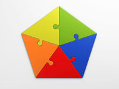
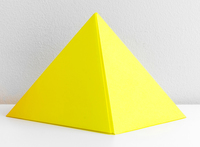

#### decimal
adjective

relating to or expressed in a system of counting based on the number ten:

1. If you calculate the result **to** two decimal places

#### dimension
noun

#### dimensional
adjective

#### square

#### pentagon
noun

a shape with five sides and five angles

#### diameter
noun

(the length of) a straight line that reaches from one point on the edge of a round shape or object, through its centre, to a point on the opposite edge:

#### radius
noun

#### circumference
noun

#### sphere
noun

#### cube

#### pyramid
noun

a solid object with a square base and four triangular sides that form a point at the top:

#### spiral
noun

#### multiple
adjective

1. very many of the same type, or of different types:
   
   1. The young man died of multiple burns.
   2. We made multiple copies of the report.

