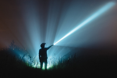
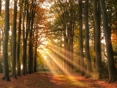
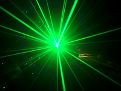

#### neutral
adjective

1. not saying or doing anything that would encourage or help any of the groups involved in an argument or war:
   
   1. If there's an argument between my daughter and her mother, it's important that I **remain** neutral.

#### racket
noun

an unpleasant loud continuous noise

1. They were **making** such a racket outside that I couldn't get to sleep.

#### duration
noun

the length of time that something lasts:

1. He planned a stay of two years'duration.

#### continuous
adjective

without a pause or interruption:

1. She is in continuous pain.
2. My computer makes a continuous low buzzing noise.
3. A continuous whiteline(= line without spaces) in the middle of the road means no overtaking.

#### continual
adjective

happening repeatedly, usually in an annoying or not conventient way:

1. I've had continual **problems** with this car ever since I bought it.
2. I'm sorry - I can't work with these continual interruptions.

#### patter
noun/verb 

1. continuous and sometimes funny speech or talk, especially used by someone trying to sell things or by an entertainer:

   1. He should succeed - he dresses well and his sales patter is slick and convincing.

2. the sound of a lot of things gently and repeatedly hitting a surface:
   
   1. I find the patter of rain on the roof soothing.

#### soothe
verb

to make someone feel calm or less worried:

1. to soothe a crying baby.

#### bang
verb/noun

1. to (cause something to) make a sudden very loud noise or noises:
   
   1. She banged her fist angrily on the table.
   2. Outside a door was banging in the wind.
   3. He could hear someone banging **at** the door.
   4. I could hear her in the kitchen banging **about** (= doing things noisily).

#### chime
verb/noun

(of bells) to make a clear ringing sound:

1. In the square the church bells chimed.

#### clang
verb

1. to make a loud deep ringing sound like that of metal being hit, or to cause something to make this sound:
   
   1. He woke up to hear the sound of bells clanging in the distance.

#### clatter
verb

to make continuous loud noises by hitting hard objects against each other, or to cause objects to do this:

1. Don't clatter the dishes - you'll wake the baby up.
2. He was clattering **away** at his keyboard.

#### crash
verb

to hit something, often making a loud noise or causing damage:

1. We could hear waves crashing **on/against** the shore.
2. Suddenly, cymbals crashed and the orchestra began playing.

#### hiss
verb/noun

a sound like the letter s:

1. I heard a hiss and a pop as thec cork came out of the bottle.

#### hum
verb/noun

1. to make a continuous low sound:

   1. The computers were humming in the background.
   2. What's that strange humming sound?

2. to sing without opening your mouth:
   
   1. She hummed to herself as she walked to school.
   2. I've forgotten how that song goes - could you hum it for me?

#### rattle
verb/noun

a sound similar to a series of quickly repeated knocks:

1. From across the town came the rattle of machine-gun fire.

#### roar
verb/noun

1. to make a long, loud, deep sound:
   
   1. We could hear the lions roaring at the other end of the zoo.
   2. 

2. If a vehicle or aircraft roars somewhere, it moves there very quickly making a lot of noise.
   
   1. She looked up as a plane roared overhead.
   2. The street was full of boys roaring up and down on their motorbikes.

3. to shout loudly:
   
   1. "Stop that!" he roared.

#### rumble
verb/noun

1. to make a continuous low sound:
   
   1. Please excuse my stomach rumbling - I haven't eaten all day.
   2. Thunder rumbled in the distance.
   3. Convoys of tanks rumbled (= moved while rumbling) through the city streets.

2. to discover the true facts about someone or something secret and often illegal:
   
   1. His boss eventually rumbled him, and he was sacked.

#### rustle
verb/noun

If things such as paper or leaves rustle, or if you rustle them, then move about and make a soft, dry sound:

1. The leaves rustled in the breeze.
2. He rustled his papers(= noisily moved them about) to hide his embarrassment.

#### screech
verb/noun

to make an umpleasant, loud, high noise:

1. She was screeching at him at the top of her voice.
2. He was screeching **with** pain/laughter.
3. The car screeched **to a halt/standstill** (= stopped very suddenly, making a loud high noise).
4. The economic recovery is likely to screech **to a halt/standstill** (= stop very suddenly) if taxes are increased.

#### thud
noun/verb

the sound that is made when something heavy falls or hits something else:

1. The boy fell to the ground **with a ** thud.
2. I could hear the thud **of** horses'hoofs down the dirt road.

#### gloomy
adjective

1. unhappy and without hope:
   
   1. a gloomy person/expression
   2. The cemetery is a gloomy place.

2. not expecting or believing anything good in a situation:
   
   1. a gloomy economic forecast
   2. The vet is rather gloomy about my cat's chances of recovery.

3. dark in a way that is unpleasant and makes it difficult to see:
   
   1. What gloomy  weather we're having!
   2. We waited in a gloomy waiting room.

adverb: gloomily
noun: gloominess

#### dim
adjective

1. not giving or having much light:
   
   1. The lamp gave out a dim light.
   2. He sat in a dim corner of the waiting room.
   3. We could see a dim(= not easily seen) shape in the fog.

2. If your eyes are dim, you cannot see very well.

3. a dim memory, recollection, etc.: something that you remember slightly, but not very well:
   
   1. I had a dim recollection **of** having met her before.

#### sombre
adjective

1. serious, sad, and without humour or entertainment:
   
   1. a sombre atmosphere/voice/face.
   2. The funeral was a sombre occasion.
   3. I left them in a sombre mood.

#### beam
noun

1. a line of light that shines from a bright object:

   
   
   1. We could just pick out the trail in the weak beam of the flashlight.
   2. The rabbit stopped, mesmerized by the beam **of** the car's headlights.

sumbeam: a beam of light from the sun that you can see:

moonbeam: a beam or line of light that comes from the moon:

#### sparkle
verb

1. to shine brightly with a lot of small points of light:
   
   1. The snow/sea sparkled in the sunlight.

2. If a person or performance sparkles, they are energetic, interesting, and exciting:
   
   1. Alice is shy and quiet at parities, but her sister really sparkles!

#### flash
verb

1. to shine brightly and suddenly, or to make something shine in this way:
   
   1. Stop flashing that light **in** my eyes!
   2. The lightning flashed and distant thunder rolled.
   3. You'd better slow down, that car was flashing its lights **at** you.

2. If someone's eyes flash, they look bright because of the anger or excitement the person is feeling.

3. to move very fast:
   
   1. They flashed **past/by** on a motorcycle.

4. to show something for a short time:
   
   1. He flashed a smile and offered to buy me a drink.

#### twinkle
verb

(of light or a shiny surface) to shine repeatedly strongly then weakly, as if flashing on and off very quickly:

1. The lights of the town twinkled in the distance.
2. The stars twinkled in the clear sky.
3. His brown eyes twinkled behind the gold-rimmed glasses.

#### flicker
verb

1. to shine with a light that is sometimes bright and sometimes weak:
   
   1. I felt a cold draft and the candle started to flicker.

2. to appear for a short time or to make a sudden movement:
   
   1. A smile flickered across her face.
   
#### glow
verb

1. to produce a continuous light and sometimes heat:
   
   1. A nightlight glowed dimly in the corner of the children's bedroom.
   2. This substance is so radioactive that is glows in the dark.

2. to look attractive because you are happy or healthy, especially with eyes that are shining:
   
   1. The children's faces were glowing with excitement.
   2. They came back from their week at the beach, glowing **with** health.

#### ray
noun

1. a narrow beam of light, heat, etc. travelling in a straight line from its place of origin:
   
   

   1. A ray of sunshine shone through a gap in the clouds.
   2. Light rays bend as they pass from air to water.

#### glitter
verb

1. to produce a lot of small, bright flashes of reflected light.
   
   1. Her diamond necklace gilttered brilliantly under the spotlights.
   
2. If someone's eyes giltter, they look bright and express strong feeling:
   

   

