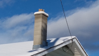

#### shrewd
adjective

1. having or based on a clear understanding and good judgment of a situation, resulting in an advantage: (明智的；精明的)
   
   1. [+ to infinitive] He was shrewd **enough** not **to** take the job when there was the possibility of getting a better one a few months later. (他很聪明没有接受那份工作，因为几个月后他有可能会得到更好的工作。)
   
   2. She is shrewd **politician** who wants to avoid offending the electorate unnecessarily. (她是一个精明的政治家，想避免不必要地得罪选民。)

   3. It was a shrewd **move** to buy your house just before property prices started to rise. (在房地产价格开始上涨之前购买房子是个明智之举。)

#### astute
adjective

able to understand a situation quickly and see how to take advantage of it: (敏锐的；精明的)

1. an astute investor/businesswoman (精明的投资者／女商人)
2. his astute handling of the situation (他对局势的巧妙处理)
3. an astute observer of human behaviour (人类行为的敏锐观察者)

#### calculating
adjective

often controlling situations for your own adcantage in a way that is slightly unpleasant and causes people not to trust you: (工于心计的；精明的；狡猾的)

1. In the film she's depicted as a very cold and calculating character. (在影片中，她被刻画成了一个冷漠且工于心计的人物。)

#### depict
verb

1. to represent or show something in a picture or story: (描绘，描述，描写)
   
   1. Her paintings depict the lives of ordinary people in the last century. (她的画反映了上个世纪普通人的生活。)

   2. In the book, he depicts his father as a tyrant. (在那本书里，他把自己的父亲描写成了一个暴君。)
 
   3. [+ -ing verb] People were shocked by the advertisement which depicted a woman beating her huaband. (人们对那个女人殴打丈夫的广告感到非常震惊。)
   
   4. In the film, he is able to depict the sense of otherness (不同性；相异；另类) and alienation (疏离感；疏远感) that many teenagers feel. (在这部电影中，他能表现出许多青少年所感受到的另类和格格不入的感觉。)

#### thick
adjective

1. (not thin) having a large distance between two sides: (厚的；粗的；粗壮的)
   
   1. a thick rope (粗绳子)
   2. a thick layer of dust. (厚厚的一层灰)
   3. She picked up a thick volume and began to read out loud. (她拿起一本大部头书，开始大声朗读。)
   4. The walls are two metres thick. (墙有两米厚。)
   5. a thick(= made of thick material) sweater/coat (厚毛衣／外套)

2. (close together) growing close together and in large amounts: (密的，密集的；茂密的)
   
   1. thick forest (茂密的森林)
   2. thick, dark hair (浓密的黑发)

3. difficult to see through: (能见度低的，浓的)
   
   1. Thick,black smoke was pouring out of the chimney. (浓黑的烟雾从烟囱里喷了出来。)
   
4. (of a liquid) not flowing easily: (（液体）稠的，浓的)
   
   1. thick soup (浓汤)
   2. a thick sauce (稠酱汁)
   3. thick paint (稠油漆)

5. (informal, UK) stupid: (愚蠢的，笨的)
   
   I told you not to touch that - are you deaf or just thick?

#### chimney
noun

a hollow structure that allows the smoke from a fire inside a building to escape to the air outside: (烟囱；烟道)

Factory chimneys belched dense white smoke into the sky. (工厂的烟囱向空中喷吐出浓浓的白烟。)

#### belch
verb

1. to allow air from the stomach to come out noisily through the mouth: (打嗝)
   
   1. He belched noisily.

2. to produce a large amount of a substance such as gas or smoke, especially when this is unpleasant or harmful, or to be produced like this:
   
   1. The exhaust pipe belched **out** dense black smoke.
   2. He swigs from his drink, then belches.

#### dense
adjective

having parts that are close together so that it is difficult to go or see through: (浓的，浓密的；浓重的)

1. dense fog (浓雾)
2. a dense forest (密林)
3. The body was found hidden in dense undergrowth. (尸体被发现时藏在密密的树丛下面。)

#### squat
verb

1. to position yourself close to the ground balancing on the front part of your feet with your legs bent under your body: (蹲，蹲坐)
   
   
   
   1. She squatted on the ground and warmed her hands by the fire (她蹲在地上，伸出双手烤火。)
   2. He squatted **down** and examined the front wheel of his bike. (他蹲下身来，检查自行车的前轮。)

2. to live in an empty building or area of land without the permission of the owner: (擅自占用（空房或空地）；偷住)
   
   They squatted (in) an old house in King's Cross when their money ran out. (他们钱花光后，就偷偷住进了国王十字车站的一处旧房子里。)

adjective

1. short and wide, usually in a way that is not attractive: (低矮的；矮墩墩的，矮胖的)
   
   1. a row of ugly, squat houses (一排低矮难看的房子)
   2. a heavily built, squat man (矮胖的男人)

#### deceive
verb

1. to persuade someone that something false is the truth, or to keep the truth hidden from someone for your own advantage: (欺骗，蒙骗；隐瞒)
   
   1. The company deceived customers by selling old computers as new ones. (该公司用旧计算机冒充新机器欺骗顾客。)
   2. The sound of the door closing deceived me **into** thinking they had gone out. (关门声让我以为他们已经出门了。)

2. deceive yourself: to refuse to accept the truth: (自欺欺人，欺骗自己)
   
   She thinks he'll come back, but she's deceiving herself. (她认为他会回来，实际上她是在自欺欺人。)

#### cunning
adjective

1. (clever) cunning people are clever at planning something so that they get what they want, especially by tricking other people, or things that are cleverly made for a particular purpose: (狡猾的，狡诈的)
   
   1. a cunning plan/ploy (诡诈的计划／花招)
   2. He's a very cunning man (他为人十分狡猾。)

#### ploy
noun

something that is done or said in order to get an advantage, often dishonestly: (计谋，策略；手法，花招)

There are various ploys we can use if necessary. (必要的话，我们可以用各种手段。)

[+ to infinitive] He only said he had a meeting as ploy to get her to leave. (他说他有一个会议要参加，只是为了把她支开。)

#### crafty
adjective

1. (clever) clever, especially in a dishonest or secret way: (狡猾的；狡诈的，诡计多端的)
   
   1. I have some crafty ideas for getting around the regulations. (我想出了个妙计可以钻这些规定的空子。)
   2. She was a crafty old woman. (她是个诡计多端的老太太。)

2. (arts and crafts) relating to crafts(= sewing, woodwork, etc.):
   
   We sell wool, paints, glue, and other crafty supplies.

#### sly
adjective

1. deceiving people in a clever way in order to get what you want: (狡猾的，狡诈的)

He's a sly old devil - I wouldn't trust him with my money. (他是个老滑头——我不会把钱交托给他的。)

2. seeming to know secrets: (诡秘的)
   
   "You'll find out eventually", said Mary, with a sly smile. (“你最终会知道的，”玛丽诡秘地笑着说。)

3. on the sly: If you do something on the sly, you do it secretly because you should not be doing it: (暗中，偷偷地)

   1. He drives his mother's car on the sly while she's at work. (他在母亲上班的时候偷开她的汽车。)

#### pessimistic
adjective

1. thinking that bad things are more likely to happen or emphasizing the bad part of a situation: (悲观的)
   
   1. The tone of the meeting was very pessimistic (会议的气氛非常悲观。)
   2. The doctors are pessimistic(= not hopeful) about his chances of recovery. (医生们对他康复的可能性表示悲观。)

adverb: pessimistically
noun: pessimist, pessimism

Synonym:

gloomy(without hope): unhappy and without hope: (忧郁；愁闷；沮丧)

a gloomy person/expression (一个愁容满面的人／一个沮丧的表情)

The cemetery is a gloomy place (墓地是个让人感到压抑的地方。)

#### optimistic
adjective

hoping or believing that good things will happen in the future: (乐观的)

She is optimistic **about** her chances of winning a gold medal. (她对赢得金牌很乐观。)

She ended her speech on an optimistic note.

adverb: optimistically
noun: optimist, optimism

#### extrovert
noun

1. an energetic person who enjoys being with other people: (性格外向的人)
   
   1. Most sales people are extroverts. (大多数推销员都是性格外向的人。)

adjective

1. energetic and enjoying being with other people:

   an extrovert personality

#### introvert
noun

1. someone who is shy, quiet, and prefers to spend time alone rather than often being with other people:

#### sociable
adjective

sociable people like to meet and spend time with other people: (好交际的；善于社交的；合群的)

Rob's very sociable - he likes parties.

I had a headache and I wasn't feeling very sociable.

Opposite: unsociable

#### gregarious
adjective

(of people) liking to be with other people: (（人）爱交际的，不喜独处的)

Emma's a gregarious, outgoing sort of person. (埃玛是个喜欢交际、性情爽直的人。)

#### cruel
adjective

1. extremely unkind and unpleasant and causing pain to people or animals intentionally: (残忍的；残酷的；刻毒伤人的)
   
   1. Don't tease him about his weight - it's cruel. (别拿他的体重开玩笑——这样太刻薄了。)
   2. Children can be very cruel to each other. (小孩相互之间会很残忍。)

2. causing suffering (令人痛苦的)
   
   1. His death was a cruel **blow**. (他的死是个无情的打击。)

#### sadistic
adjective

getting pleasure, sometimes sexual, by being cruel to or hurting another person： (施虐狂的；性施虐狂的)

1. sadistic behaviour / pleasure (施虐行为/快感)
2. a sadistic serial murderer (一名施虐狂连环杀人犯)

noun

sadist: a person who gets pleasure, sometimes sexual, by being cruel to or hurting another person (施虐狂者；性施虐狂者)

sadism: the activity of getting pleasure, sometimes sexual, from being cruel to or hurting another person. (施虐狂；性施虐狂)

#### easy-going
adjective

relaxed and not easily upset or worried: (不慌不忙的，悠闲的；脾气随和的，温和的)

an easy-going attitude/manner (从容悠闲的态度／举止)

a friendly, easy-going type of guy (友好、随和的人)

#### even-tempered
adjective

always calm and never angry or too excited about anything: (性情平和的；稳重的；不易激动的)

### relaxed
These words all describe a person who feels happy or comfortable because nothing is worrying them.

One of the most common words for this is **relaxed**。 Relaxed refers to calmness and physical rest.

+ After my massage, I was quite relaxed.

If someone is **rested** (（休息后）有精力的，精神的，健康的, they are relaxed and have the energy to become more active again.

+ After our long holiday, I was rested and ready to get back to work.

A person who is or who feels **mellow** (柔和的；温和的；芳醇的)is relaxed and pleasant.**Mellow** is more informal than relaxed is, and it can refer to a temporary state or a person's character.

+ He is a very mellow baby
+ Sha was feeling mellow after a long walk in the woods.

An easy-going person is a person who is relaxed and does not get worried very easily.**Easy-going** is an approving word.

+ She's a generous and easy-going boss.
+ His easy-going attitude is very soothing

If a person is always relaxed and does not worry much,you can say in informal contexts that they are **laid-back** (轻松的，悠闲的，不着急的).**Laid-back** is not as approving as easy-going, but it usually has positive connotations.

+ He's so laid-back, I've never seen him get upset about anything. (我从未见她着过急——她总是这样不慌不忙的。)

An informal word for relaxed is chill. If you are chill, you are relaxed and do not show emotion because it would be unpopular or unfashionable to show emotion.

+ I'm a chill guy.
+ I thought she would freak out, but she was so chill about it.

#### discourteous
adjective,formal

rude and not considering other people's feelings: (粗鲁的，粗暴的，失礼的)

The employees were unhelpful and discourteous. (这些雇员不愿意提供帮助而且粗暴无礼。)

#### courteous
adjective

polite and showing respect: (有礼貌的；谦恭有礼的)

Although she ofen disagreed with me, she was always courteous. (尽管她常常和我意见不一致，却总是客气有礼。)

The ticket clerk was courteous and helpful.

#### well-mannered
adjective

behaving in a pleasant and polite way: (彬彬有礼的)

The other visitors were too well-mannered to complain. (其他的参观者出于礼貌没有抱怨。)

#### trustworthy
adjective

able to be trusted (值得信任的；可信的；可靠的)

Not even a newspaper always gives us trustworthy information.

noun: trustworthiness (可靠性，可信度)

He has a well-earned reputation for absolute trustworthiness.

We have a brand (商标，牌子) that is perceived as trustworthy.

#### sincere
adjective

(of a person, feelings, or behaviour) not pretending or lying; honest: (（人、感情或行为）真诚的，诚实的)

+ a sincere apology (真诚的道歉)
+ He seems so sincere (他看上去很真诚。)

Opposite: insincere

#### jealous
adjective

1. upset and angry because someone that you love seems interested in another person: (妒忌的；好妒忌的；吃醋的)
   
   1. a jealous husband/wife (吃醋的丈夫／妻子)
   2. Anna says she feels jealous every time another woman looks at her boyfriend. (安娜说每次别的女人看她的男朋友她都会感到妒忌。)

2. unhappy and angry because someone has something that you want: (嫉妒的)
   
   1. He had always been very jealous **of** his brother's good looks. (他兄弟的外貌总是让他嫉妒。)

#### envious
adjective

wishing you had what another person has: (羡慕的；忌妒的)

I'm very envious **of** your new coat - it's beautiful. (我真羡慕你有这么好的新外套——很漂亮。)

#### bad-tempered
adjective

A bad-tempered person becomes angry and annoyed easily: (脾气坏的，易怒的)

She's very bad-tempered in the mornings. (她上午的时候容易发脾气！)

#### quarrelsome
adjective, disapproving

A quarrlesome person repeatedly argues with other people: (好争吵的；好口角的)

#### argumentative
adjective

often arguing or wanting to argue: (好争辩的；好争吵的)

Don't be so argumentative (别那么好争辩。)

Some reported a change in their own behavior toward their spouses, such as being more considerate and less argumentative.

#### spouse
noun

1. a person's husband or wife (配偶)
    1. In 60 percent of the households surveyed both spouses went out to work. (在60%的被调查家庭中，夫妻双方都外出工作。)

#### determined
adjective

wanting to do something very much and not allowing anyone or any difficulties to stop you: (下定决心的，坚决的，决意的)

1. [+ to infinitive] I'm determined **to** get this piece of work done today. (我决心今天完成这项工作。)
2. She will get the job she wants - she's a very determined person (她肯定会得到她想要的那份工作——她是个意志很坚定的人。)

#### obstinate
adjective, usually disapproving

1. unreasonably determined, especially to act in a particular way and not to change at all, despite what anyone else says: (顽固的，固执的；倔强的)

   1. He can be very obstinate at times. (他有的时候会非常固执。)
   2. Her obstinate refusal to compromise (她的拒不妥协)

2. used to describe a problem, situation, or thing that is difficult to deal with, remove, change, or defeat: (棘手的；难以清除的；难以克服的)
   
   1. obstinate weeds (难以除尽的野草)
   2. Invading troops met with obstinate resistance by guerrilla forces. (侵略军遭到游击队的顽强抵抗。)

adverb: obstinately (顽固地): The engine obstinately refused to start.
noun: obstinacy: the obstinacy of the human spirit

#### stubborn
adjective

1. (disapproving) a stubborn person is determined to do what he or she wants and refuses to do anything else: (顽固的，执拗的，倔强的)
   
   1. They have huge arguments because they're both so stubborn. (他们俩吵得很凶，因为他们两个人都很固执。)

2. Things that are stubborn are difficult to move,change,or deal with: (难移动的；难改变的；难对付的)
   
   1. He was famed for his stubborn resistance and his refusal to accept defeat. (他以顽强抵抗、不甘失败著称。)
   2. Stubborn **stains** can be removed using a small amount of detergent. (使用少量清洁剂即可去除顽渍。)

#### thrifty
adjective

showing a careful use of money, especially by avoiding waste: (节约的，节俭的)

They have plenty of money now, but they still tend to be thrifty. (他们现在很有钱，但仍很节俭。)

#### economical
adjective

not using a lot of fuel, money, etc.: (经济的；省钱的；节约的)

1. There's increasing demand for cars that are more economical **on** fuel. (对低油耗汽车的需求与日俱增。)
2. What's the most economical way of heating this building？ (给这座楼供暖，怎样做才是最经济的方法？)

#### stingy
adjective, informal, disapproving

unwilling to spend money; small in amount: (小气的，吝啬的)

1. He's really stingy and never buys anyone a drink when we go out. (他非常小气，我们一起出去时他从来不请喝酒。)
2. The landlords are so stingy - they refused to pay for new carpets. (房东们太小气了——他们拒绝掏钱买新地毯。)

#### mean
adjective

not willing to give or share things, especially money: (吝啬的，小气的)

He's too mean to buy her a ring (他太吝啬了，舍不得给她买一枚戒指。)

My landlord's very mean **with** the heating - it's only on for two hours each day. (我的房东对使用暖气很吝啬——每天只开两个小时。)

#### tight-fisted
adjective, informal, disapproving

unwilling to spend money: (用钱不大方的，吝啬的)

Don't wait for Gillian to buy you a drink - she's too tight-fisted. (别幻想吉莉恩会给你买饮料——她这人太小气。)

#### miserly
adjective, disapproving

1. like or typical of a miser: (守财奴似的；吝啬鬼似的；吝啬的，小气的)

   a miserly person (吝啬的人)

2. A miserly amount is extremely small: (极少的，极小的)
   
   The workers are paid a miserly $2 a day (工人们每天才挣极少的2美元。)
   
#### self-assured
adjective, approving

1. having confidence in your own abilities: (自信的)
   
   The interview showed her as a self-assured and mature student. (面试显示出她是个自信成熟的学生。)

#### mature
adjective

1. mature people behave like adults in a way that shows they are well developed emotionallly.
    1. He's very mature for his age (就他的年纪而言，他已非常成熟。)

#### self-important
adjective, disapproving

believing that you are more important or have a higher value than other people: (妄自尊大的，高傲的)

1. He never comes across as pompous or self-important (他从不给人以浮夸或自负的印象。)
2. I look at these very serious, self-important people, and I just don't want to be like that.

#### pompous
adjective

1. too serious and full of importance: (妄自尊大的，自以为是的)
    1. He's a pompous old prig who's totally incapable of taking a joke. (他是个傲慢自负的老头，根本开不起玩笑。)

#### arrogant
adjective

unpleasantly proud and behaving as if you are more important than, or know more than, other people: (傲慢的；狂妄自大的；趾高气扬的)

I found him arrogant and rude. (我觉得他这个人狂妄自大、粗鲁无礼。)

I never met a more conceited and arrogant young man.

adverb: arrogantly
noun: arrogance, I was disgusted by his arrogance.

#### unconventional
adjective

different from what is usual or from the way most people do things: (不因循守旧的；不同寻常的)

an unconventional childhood/lifestyle/marriage (不一样的童年／生活方式／婚姻)

He has an unconventional attitude toward work.

#### original
adjective

1. existing since the beginning, or being the earliest form of something: (起初的，原先的，最早的)
   
   1. Is this the original fireplace? (这是原先的壁炉吗？)
   2. The gardens have recently been restored to their original glory. (这些园林最近恢复了原先的辉煌。)

2. an original piece of work, such as a painting, etc. is produced by the artist and not a copy: (原作的，真迹的，非赝品的)
   
   1. an original drawing/manuscript (原画／稿)
   2. Is this an original Rembrandt? (这是伦勃朗的原作吗？)

#### eccentric
adjective

strange or unusual, sometimes in a humorous way: (怪异的，古怪的；异乎寻常的)

1. eccentric behaviour (怪异的行为)
2. eccentric clothes (奇装异服)

#### peculiar
adjective

unusual and strange, sometimes in an unpleasant way: (奇怪的，古怪的)

1. She has the most peculiar ideas. (她的想法非常古怪。)
2. What a peculiar smell! (多么奇怪的气味！)
3. It's peculiar **that** they didn't tell us they were going away. (真奇怪，他们并没有告诉我们他们要外出。)
4. The video on road accidents made me feel rather peculiar. (交通意外的录像让我感觉很不舒服。)

#### frank
adjective

honest, sincere, and telling the truth, even when this might be awkward or make other people uncomfortable: (坦率的，坦诚的；直言不讳的)

1. a full and frank discussion (全面而坦诚的讨论)
2. There followed a frank exchange of views (接下来大家坦诚地交换了意见。)
3. The magazine, which gives frank advice about sex and romance, is aimed at the teenage market. (这本杂志面向青少年市场，对性和恋爱问题作出坦率的忠告。)
4. **To be perfectly** frank with you, I don't think she's the person for the job. (十分坦诚地告诉你，我认为她不适合做那份工作。)

#### direct
adjective

1. going in a straight line towards somewhere or someone without stopping or changing direction: (直通的，直达的)
   
   1. a direct route/line (直通的路径／线路)
   2. Is there a direct train to Edinburgh? (有到爱丁堡的直达列车吗？)

2. without anyone or anything else being involved or between: (直接的)
   
   1. She decided to take direct control of the project. (她决定直接管理这个项目。)
   2. He denied that he had any direct involvement in the deal. (他否认自己与这笔交易有任何直接关系。)
   3. Do you have any direct experience of this kind of work? (你有没有这种工作的直接经验？)
   4. He left as a direct result/consequence of what she said (她的话是他离去的直接原因。)
   5. There is a direct link/connection between smoking and lung cancer. (吸烟与肺癌有直接的联系。)

3. direct light/heat: strong light or heat that has nothing protecting and separating you from it: (直射光线／直接受热)
   
   1. This plant should be kept out of direct sunlight. (这种植物应避免阳光直射。)

4. direct relation/relative/descendant: a relation who is related to you through one of your parents, not through an aunt or uncle, etc: (直系关系／亲属／后代)

5. complete: (完全的，全部的)
   
   1. a direct contrast (完全的对比)
   2. She's very thoughtful - the direct opposite of her sister. (她想得很周到——和她姐姐截然相反。)

6. Someone who is direct says what they think in a very honest way without worrying about other people's opinions: (直率的，坦率的，直接的)
   
   1. I like her open and direct manner. (我喜欢她坦率直接的态度。)

#### open
honest and not trying to keep things secret: (坦诚的；坦率的；毫不隐讳的)

He's very open about his weaknesses. (他对自己的弱点毫不隐瞒。)

I wish you'd be more open with me, and tell me what you're feeling. (我希望你对我更坦诚一些，把你的感受告诉我。)

She has an honest, open face. (她有一张真诚坦率的面孔。)

#### blunt
adjective

1. (not sharp) a blunt pencil, knife, etc. is not sharp and therefore not able to write, cut, etc. well. (（铅笔、刀等）钝的，不锋利的)

2. saying what you think without trying to be polite or considering other people's feelings: (直率的；生硬的；直截了当的)
   
   1. I'll be blunt - that last piece of work you did was terrible. (我就直说了——你创作的最后一件作品糟糕透了。)

2. to make something less sharp / to make a feeling less strong: (使变钝, 使（情感）减弱)
   
   My recent bad experience has blunted my enthusiasm for travel. (最近的倒霉经历已经使我对旅游的热情减弱了不少。)

#### abrupt
adjective

1. sudden and unexpected, and often unpleasant: (突然的；意外的)
   
   1. an abrupt change/movement (突变／突发情况)
   2. Our conversation came to an abrupt end when George burst into the room (乔治突然冲进房间里，我们的谈话戛然而止。)
   3. The road ended in an abrupt(= sudden and very steep) slope down to the sea. (道路沿一个险峭陡坡俯冲到海边，就到了尽头。)

2. using too few words when talking, in a way that seems rude and unfriendly: (（言语）生硬的；鲁莽的；唐突的)
   
   1. an abrupt manner/reply (唐突的举止／生硬的回答)
   2. He is sometimes very abrupt with clients (他有时对待客户非常粗鲁。)

#### brusque
adjective

quick and rude in manner or speech: (粗鲁的；唐突的)

1. His secretary was a little brusque **with** me.

#### curt
adjective, disapproving

If someone's manner or speech is curt, it is rude as a result of being very quick: (（态度或说话）简短失礼的，唐突的，草率的)

1. to give a curt nod/reply (草草点了点头／三言两语地回答)
2. Andy was very curt with him (安迪对他很是粗暴无礼。)

#### broad-minded
adjective, approving

1. willing to accept many different types of behaviour, beliefs, or choices in other people: (心胸宽广的；（尤指对性行为）开明的)
   
   1. My grandparents were surprisingly broad-minded.
   2. He is broadminded **about** the different forms families can take.

#### unprincipled
adjective

having or showing no moral rules or standards of good behaviour (不道德的；无原则的；无耻的)

oppisite: principled: always behaving in an honest and moral way: (有道德（原则）的；原则性强的)

She was as very principled woman. (她是一个品德高尚的人。)

#### permissive
adjective

A person or society that is permissive allows behaviour that other people might disapprove of: (纵容的，放纵的)

1. It's a very permissive school where the children are allowed to do whatever they want (这是一所放任自流的学校，孩子们想做什么都可以。)

2. He claims that society has been far too permissive **towards** drugs. (他宣称社会对吸毒过于放任。)

#### illiberal
adjective

limiting freedom of expression, thought, behaviour, etc.: (（言论、思想、行为等）不自由的，不开明的，狭隘的)

illiberal policies (专制的政策)

#### liberal
adjective

respecting and allowing many different types of beliefs or behaviour: (自由开放的，开放的，开明的)

a liberal society/attitude (自由开放的社会／态度)

Her parents were far more liberal than mine. (她父母比我父母开明得多。)

#### intolerant
adjective

disapproving of or refusing to accept ideas or ways of behaving that are different from your own: (不容异说的；不包容的；心胸狭隘的)

She can be very intolerant **of** students who don't understand what she's talking about. (她对听不懂她讲课的学生可能会很不宽容。)

#### inquisitive
adjective

wanting to discover as much as you can about things, sometimes in a way that annoys people: (好问的；爱钻研的；好打听的)

1. an inquisitive child (好奇爱问的小孩)
2. an inquisitive mind (爱钻研的人)
3. She could see inquisitive faces looking out from the windows next door. (她可以看到一张张好奇的面孔从隔壁房子的窗户里向外观望。)

#### extravagant
adjective

1. spending too much money, or using too much of something: (奢侈的，铺张的；浪费的)
   
   1. the extravagant lifestyle of a movie star (影星奢华的生活方式)
   2. It was very extravagant **of** you to buy strawberries out of season. (影星奢华的生活方式)
   3. He rarely used taxis, which he regarded as extravagant. (他很少坐出租车，他认为这是一种奢侈行为。)

2. extreme and unreasonable: (过度的；不切实际的)
   
   1. The product does not live up to the extravagant claims of the advertisers.

#### assertive
adjective

Someone who is assertive behaves confidently and is not frightened to say what they want or believe: (坚定自信的；果敢的)

If you really want the promotion, you'll have to be more assertive. (如果你真想得到晋升，就必须更加坚定自信地说出来。)

#### perceive
verb

1. to come to an opinion about something, or have a belief about something: (认为；看待；视为)
   
   1. How do the French perceive the British? (法国人是如何看待英国人的？)
   2. Women's magazines are often perceived to be superficial. (女性杂志通常被认为是肤浅的。)
   3. He perceived himself to be a failure, though nothing could be further from the truth.

#### superficial
adjective, disapproving

(of a person) never thinking about things that are serious or important: (（人）浅薄的，肤浅的)

He's fun to be with, but he's very superficial. (和他在一起很有趣，但是他见识很肤浅。)

#### dwell
verb,formal

to live in a place or in a particular way: (居住，栖身)

She dwelt **in** remote parts of Asia for many years. (她在亚洲边远地区居住了很多年。)

dwell on sth: to keep thinking or talking about something, especially something bad or unpleasant:

In his speech, he dwelt on the plight of the sick and the hungry. (演讲时他一直在说遭受疾病和饥饿折磨的人们所处的困境。)

"Let's not dwell on the past", she said.

#### plight
noun

1. an unpleasant condition, especially a serious, sad, or difficult one: (困境，窘境)
    1. the plight of the poor/homeless.  (穷人／无家可归者的困难处境)
    2. Few of us can be unmoved by the plight of the refugees. (我们几乎无一不被难民的困难处境所触动。)

