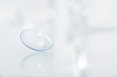

#### nasty
adjective

1. bad or very unpleasant:
   
   1. a nasty shock/surprise
   2. There's a nasty smell in here
   3. He had a nasty cut above the eye.
   4. She has a nasty habit of picking on people in meetings.

2. unkind:
   
   1. Don't be so nasty **to** your brother - he's four years younger than you

3. Idiom: a nasty piece of work : a very unpleasant person.
   
   1. He's a nasty piece of work.

#### nuisance
noun

1. something or someone that annoys you or causes trouble for you:
   
   1. I've forgotten my umbrella - **what a** nuisance!
   2. [+ -ing verb] It's such a nuisance having to rewrite those letters.
   3. I hate to be a nuisance, but could you help me?
   4. Local residents claimed that the noise was causing a **public** nuisance.

2. make a nuisance of yourself:
   
   1. to cause trouble or to annoy other people

#### irritate
verb

1. (make angry) to make someone angry or annoyed:
   
   1. After a while her behaviour really began to irritate

2. to make a part of your body sore or painful:
   
   1. Af first my contact lenses irritated my eyes.

#### lens
noun

1. (glass) a curved piece of glass, plastic, or other transparent material, used in cameras,glasses, and scientific equipment, that makes objects seeem closer,larger,smaller,etc.:

   
    
   a camera with a zoom lens:

   

2. contact lens
   
   

#### zoom
verb,infomal

1. to move very quickly:
   
   1. Cars and trucks zoom past.

2. If costs,sales,etc.,zoom,they increase quickly:
   
   In two months the magazine's circulation zoomed to 26,000.

#### vertigo
noun

a feeling of spinning around and being unable to balance, often caused by looking down from a height:

She can't stand heights and has always suffered from vertigo.

Synonym:

#### dizziness
noun

a temporary feeling that your sense of balance is not good and that you may fall down:

The sight of blood may cause dizziness in some people

#### sieve
noun

a tool consisting of a wood, plastic, or metal frame with wire or plastic net attached to it.You use it either to separate solids from a liquid, or you rub larger solids through it to make them smaller:

Pass the sauce through a sieve to remove any lumps.

#### exaggerated
adjective

seeming larger, more important, better, or worse than it really is:

1. exaggerated reports of the problem.
2. The slimming effect of wearing black has been greatly exaggerated.

#### radical
adjective

1. (supproting change) believing or expressing the belief that there should be great or extrme social or political change:
   
   1. He was known as a radical reformer/thinker/politician
   2. These people have very radical views

2. (very important) relating to the most important parts of something or someone; complete or extreme:

   1. We need to make some radical changes to our operating procedures.
   2. I'm just having my hair trimmed. - nothing radical.

noun

1. a person who supports great social and political change:
   
   1. She was a radical all her life.

e